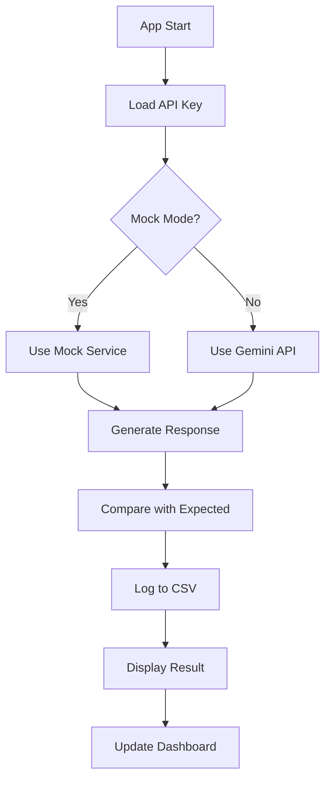

# Chatbot QA Automation System | Streamlit, Gemini API, Python

[](https://www.python.org/)
[](https://streamlit.io/)
[](https://ai.google.dev/)
[](LICENSE)

## 📋 Table of Contents
- [Overview](#overview)
- [What This Project Helps With](#what-this-project-helps-with)
- [Features](#features)
- [Project Structure](#project-structure)
- [Tech Stack](#tech-stack)
- [Prerequisites](#prerequisites)
- [Installation & Setup](#installation--setup)
- [Usage](#usage)
- [Configuration](#configuration)
- [How It Works](#how-it-works)
- [Screenshots](#screenshots)
- [Contributing](#contributing)
- [License](#license)

---

## 🎯 Overview

**Chatbot QA Automation System** is a Streamlit-based testing framework designed to validate conversational AI chatbot responses against expected outputs. It supports both **mock responses** (offline testing) and **live Google Gemini API responses**, providing automated logging, real-time dashboards, and downloadable test reports.

This tool is ideal for QA engineers, test automation specialists, and AI teams who need to:
- Validate chatbot flows before production
- Monitor response accuracy over time
- Automate repetitive testing tasks
- Generate compliance and performance reports

---

## 🚀 What This Project Helps With

### **1. Automated Chatbot Testing**
- Eliminates manual copy-paste validation of chatbot responses
- Reduces QA effort by **>70%** through automation
- Enables regression testing for conversational AI models

### **2. Early Bug Detection**
- Catches incorrect, inconsistent, or off-brand responses before production
- Validates that chatbot responses match expected behavior
- Supports rapid iteration during development cycles

### **3. Dual Testing Modes**
- **Mock Mode**: Test offline without API costs or internet dependency
- **Live Mode**: Validate real Gemini API responses with automatic model fallback handling

### **4. Compliance & Reporting**
- Logs every test run with timestamp, prompt, expected vs actual response, and pass/fail status
- Generates downloadable CSV reports for stakeholders and audits
- Provides real-time dashboard with metrics and visualizations

### **5. Cost-Effective QA**
- Mock mode allows unlimited testing without API charges
- Reduces manual QA hours and accelerates release cycles
- Scalable framework for testing multiple chatbot flows

---

## ✨ Features

- ✅ **Dual Testing Modes**: Mock responses (offline) or live Gemini API calls
- 📊 **Real-Time Dashboard**: View test metrics (Total, Passed, Failed) with bar charts
- 📝 **Automated Logging**: All tests logged to `test_results.csv` with UTF-8 encoding
- 🔄 **Model Fallback Logic**: Automatically tries alternate Gemini models if primary fails
- 🔑 **Flexible API Key Handling**: Supports `.env`, Streamlit secrets, or environment variables
- 📥 **Report Export**: Download full test history as CSV
- 🛡️ **Error Handling**: Graceful handling of API failures, missing files, and encoding issues
- 🎨 **User-Friendly UI**: Clean Streamlit interface with sidebar controls

---

## 📁 Project Structure

```
chatbot-qa-automation/
│
├── app.py                      # Main Streamlit application
├── services/
│   ├── mock_service.py         # Mock chatbot response generator
│   ├── gemini_service.py       # Google Gemini API integration
│   └── logging_service.py      # CSV logging with safe header handling
│
├── requirements.txt            # Python dependencies
├── .env.example                # Example environment variables
├── test_results.csv            # Auto-generated test log (created on first run)
└── README.md                   # This file
```

---

## 🛠️ Tech Stack

| Technology | Purpose |
|------------|---------|
| **Python 3.8+** | Core programming language |
| **Streamlit** | Interactive web UI framework |
| **Google Gemini API** | Live chatbot response generation |
| **Pandas** | CSV data handling and analysis |
| **python-dotenv** | Environment variable management |

---

## 📋 Prerequisites

- Python 3.8 or higher
- Google Gemini API Key (optional for mock mode)
- pip (Python package manager)

---

## 🔧 Installation & Setup

### **Step 1: Clone the Repository**
```bash
git clone https://github.com/yourusername/chatbot-qa-automation.git
cd chatbot-qa-automation
```

### **Step 2: Create Virtual Environment (Recommended)**
```bash
# Windows
python -m venv venv
venv\Scripts\activate

# macOS/Linux
python3 -m venv venv
source venv/bin/activate
```

### **Step 3: Install Dependencies**
```bash
pip install -r requirements.txt
```

### **Step 4: Set Up API Key (Choose One Method)**

#### **Option A: Using `.env` File (Recommended)**
1. Copy the example file:
   ```bash
   cp .env.example .env
   ```
2. Edit `.env` and add your key:
   ```env
   GEMINI_API_KEY=your_actual_api_key_here
   ```

#### **Option B: Using Streamlit Secrets**
1. Create `.streamlit/secrets.toml`:
   ```bash
   mkdir .streamlit
   nano .streamlit/secrets.toml
   ```
2. Add:
   ```toml
   GEMINI_API_KEY = "your_actual_api_key_here"
   ```

#### **Option C: Using Environment Variables**
```bash
# Windows PowerShell
$env:GEMINI_API_KEY="your_actual_api_key_here"

# macOS/Linux
export GEMINI_API_KEY="your_actual_api_key_here"
```

### **Step 5: Run the Application**
```bash
streamlit run app.py
```

The app will open in your browser at `http://localhost:8501`

---

## 📖 Usage

### **Running Tests**

1. **Select Testing Mode** (Sidebar):
   - ✅ **Mock Mode**: Enable "Use Mock Responses" for offline testing
   - 🌐 **Live Mode**: Disable for real Gemini API calls

2. **Enter Test Data**:
   - **User Prompt**: The input message to test
   - **Expected Response**: What the chatbot should respond with

3. **Run Test**:
   - Click "Run Test" button
   - View actual response and pass/fail status
   - Result automatically logged to CSV

### **Viewing Dashboard**

Navigate to the **Dashboard** tab to see:
- 📊 Total tests run
- ✅ Tests passed
- ❌ Tests failed
- 📈 Pass/Fail bar chart
- 📄 Last 10 test results

### **Downloading Reports**

Click the **"Download Test Results CSV"** button to export the full test history.

---

## ⚙️ Configuration

### **Model Selection**
Available Gemini models (Live Mode):
- Gemini 2.0 Flash (default)
- Gemini 1.5 Flash
- Gemini 1.5 Pro

The system automatically tries fallback models if the primary selection fails.

### **API Key Priority**
The app checks for API keys in this order:
1. Sidebar text input
2. Streamlit secrets (`secrets.toml`)
3. Environment variable (`GEMINI_API_KEY`)

### **Test Result Logging**
- File: `test_results.csv`
- Encoding: UTF-8 (prevents Windows encoding errors)
- Columns: Timestamp, Prompt, Expected, Actual, Status

---

## 🔍 How It Works

### **End-to-End Flow**



### **Key Components**

1. **`app.py`**: 
   - Streamlit UI orchestration
   - Configuration management
   - Model selection logic

2. **`services/mock_service.py`**:
   - Returns deterministic mock responses
   - Enables offline testing without API costs

3. **`services/gemini_service.py`**:
   - Google Gemini API integration
   - Model name resolution (e.g., "Gemini 2.0 Flash" → `gemini-2.0-flash`)
   - Automatic fallback handling

4. **`services/logging_service.py`**:
   - Appends test results to CSV
   - Safe header initialization
   - UTF-8 encoding for cross-platform compatibility

### **Pass/Fail Logic**
- **Pass**: Expected text is contained in actual response (case-insensitive)
- **Fail**: Expected text not found in actual response

---
## Dashboard


## 📸 Sample Test Execution


### Example: Failed Test Case Detection

This screenshot demonstrates a **failed test case** where the system validates a chatbot's response about RAG (Retrieval-Augmented Generation):

**Test Configuration:**
- **Mode**: Live Gemini API (Gemini 2.0 Flash)
- **User Prompt**: `"what is RAG"`
- **Expected Response**: `"random game access memory"`

**Test Result:**  **Fail**

**Actual Response:**
The Gemini API returned a comprehensive, technically accurate explanation:
> "RAG stands for Retrieval-Augmented Generation. It's a powerful technique in the field of Natural Language Processing (NLP) that combines the strengths of two different approaches: Retrieval and Generation using a large language model (LLM)..."

**Why It Failed:**
The expected response contained factually incorrect information ("random game access memory" instead of "Retrieval-Augmented Generation"). The system correctly identified the mismatch between expected and actual responses.

**What This Demonstrates:**
- ✅ Accurate validation of chatbot responses against expected outputs
- ✅ Detection of factually incorrect expected responses
- ✅ Prevention of incorrect information being approved in production
- ✅ Real-time comparison with detailed actual vs expected analysis
- ✅ Automatic logging of test results for audit trails

**Key Takeaway:**
This example shows how the QA automation system helps identify when expected responses don't align with actual AI-generated content, preventing incorrect information from being approved in chatbot flows and ensuring response quality before deployment.

---


